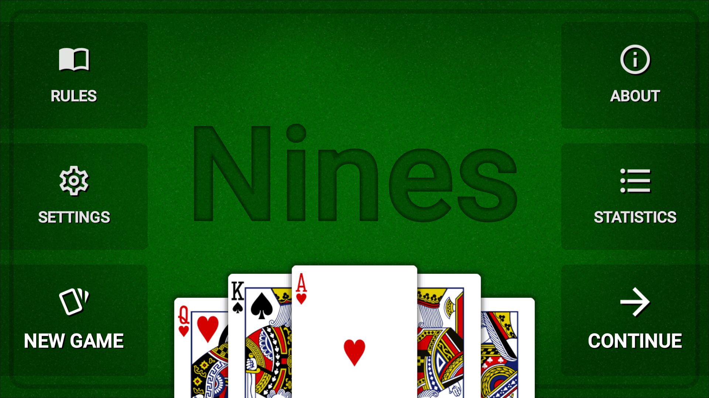
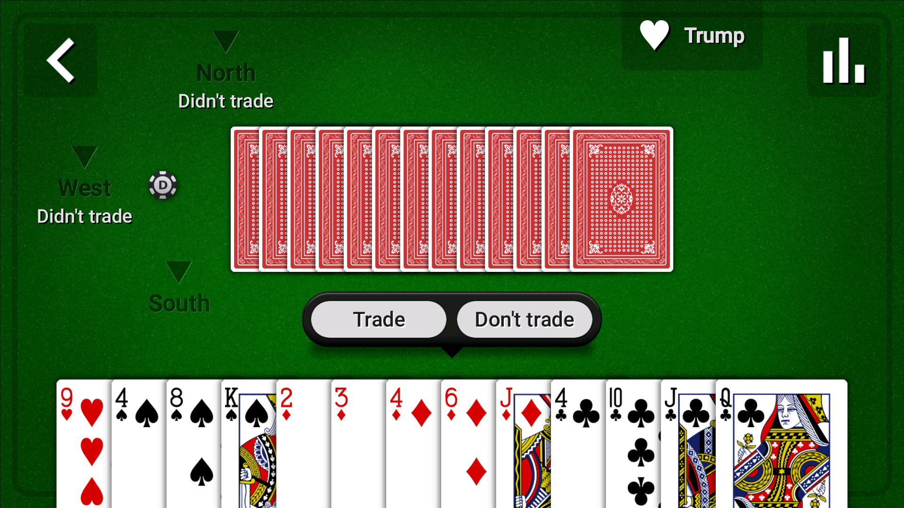

# Nines card game

*This is an archived project and won't be developed any further.*

Nines is a trick-taking card game with 3 players played with a standard deck of 52 cards.
The goal of the game is to lower your score to zero by taking as many tricks as possible on each round.
The name of the game originates from the fact that the initial score is usually 9.
See the [rules](assets/rules.md) for more information.

Download is avaible on:

- [Direct APK download](https://github.com/maltaisn/card-game-nines/releases/tag/latest)
- [Google Play Store](https://play.google.com/store/apps/details?id=com.maltaisn.nines.android)

The card game targets Android but can also be built for the desktop.
It is based on the base card game library available [here](https://github.com/maltaisn/card-game-base).

## Building

JDK 8 is required so that the built libraries are compatible with Android application that target JDK 8.
The Gradle project can be imported in IntelliJ IDEA and be built from there.

Sprites and texture packer files used are located in the `assets_raw` directory.
The GDX texture packer projects used to create the atlases are also available.
The resulting atlas will be produced in the appropriate `assets` directory.
Although the compression is set to PNGTastic, TinyPNG was used for some files in the repository
(core background & pcard) to reduce size with lossy compression.

## License

All code is licensed under Apache License 2.0.